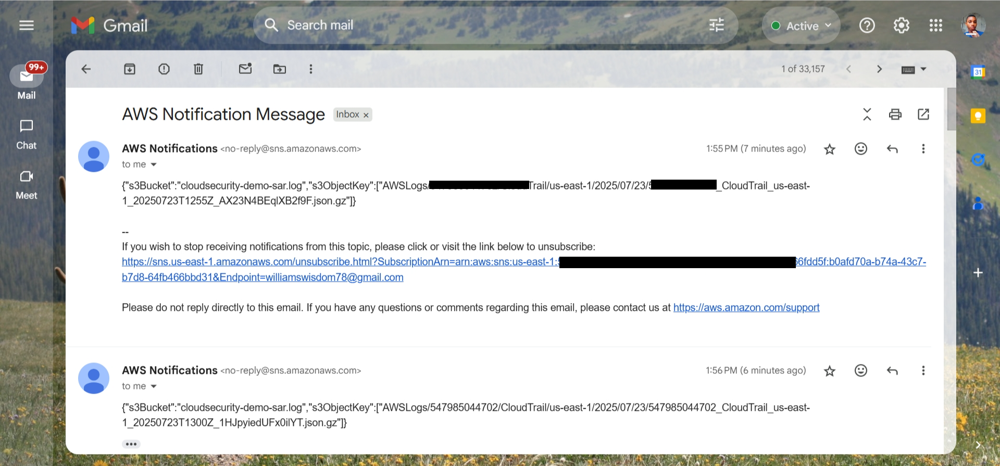

# 🔍 Security Monitoring with CloudTrail and SNS

---

## 🧭 Monitoring Root Account Usage

One of the most critical security measures I’ve implemented is tracking activity from the **root user** in AWS. Since the root account has unrestricted access, I wanted real-time alerts anytime it was used.

### 🛠️ My Setup

1. **Enabled CloudTrail logging** for all management events—both read and write.
2. **Created a CloudWatch metric filter** to detect root activity:
   ```json
   { $.userIdentity.type = "Root" && $.userIdentity.invokedBy NOT EXISTS }
   ```
   - Connected the filter to an SNS Topic that sends email notifications.
- Subscribed my email to the topic for instant alerts.
- Tested the setup by logging in with the root user and viewing billing, an alert landed in my inbox as expected.
  
📸 Screenshot:
  

### ✅ Why This Matters to Me
- I rarely use the root account, and I treat it like a red flag if it's ever activated.
- This alerting setup gives me immediate visibility and lets me take action fast if something unexpected happens.
- It’s a simple yet powerful step in building secure habits while working with cloud services.

---

## 🗂 Lifecycle Configuration for Log Files

To keep my S3 log storage lean and cost efficient, I created lifecycle rules for each bucket that holds logs; whether from **CloudTrail**, **S3 Server Access Logs**, or **Root Account Alerts**. This helps automate cleanup and prevent long-term clutter.

### 🔧 How I Set It Up

For each log bucket, I did the following:

#### 📜 CloudTrail Logs
- *Action:* Transition to S3 Glacier after 30 days
- *Deletion:* Permanently delete after 180 days
- *Reason:* I rarely need logs past 6 months, but I want archival access for audit trails.

#### 📑 S3 Server Access Logs
- *Deletion:* Delete after 60 days
- *Reason:* These logs are useful for short-term analysis and compliance checks.

#### 📬 SNS-Triggered Monitoring Logs
- *Action:* Transition to Glacier after 7 days
- *Deletion:* Delete after 90 days
- *Reason:* Root account alerts are rare and sensitive; I keep them archived briefly for forensic purposes.

---

### 🛠 Lifecycle Rule Sample (JSON)

Here’s what one of my lifecycle rule snippets looks like:

```json
{
  "Rules": [
    {
      "ID": "CloudTrailLogLifecycle",
      "Status": "Enabled",
      "Prefix": "cloudtrail/",
      "Transitions": [
        {
          "Days": 30,
          "StorageClass": "GLACIER"
        }
      ],
      "Expiration": {
        "Days": 180
      }
    }
  ]
}
```

